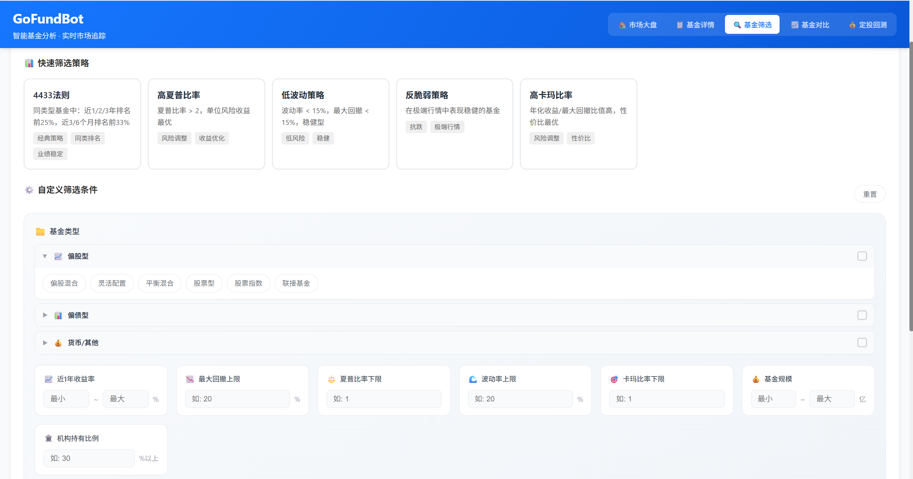
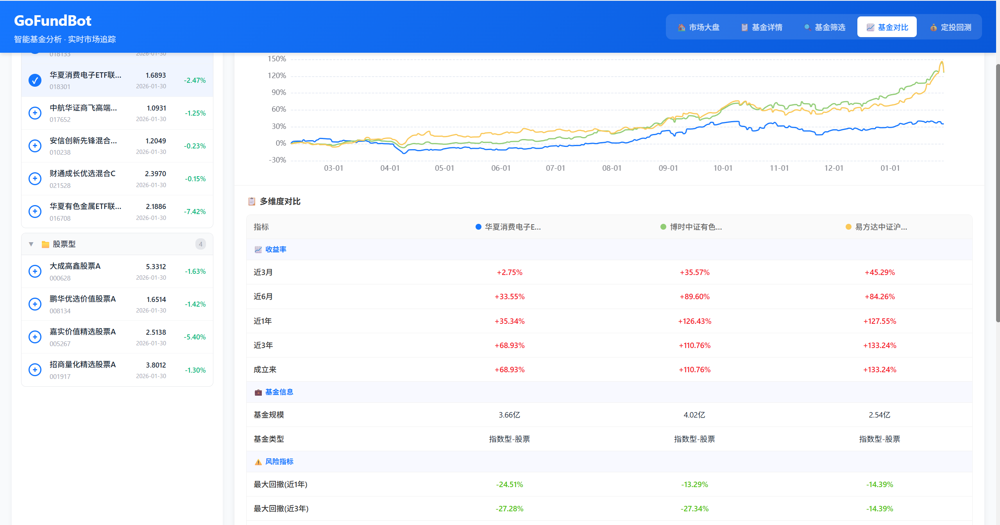
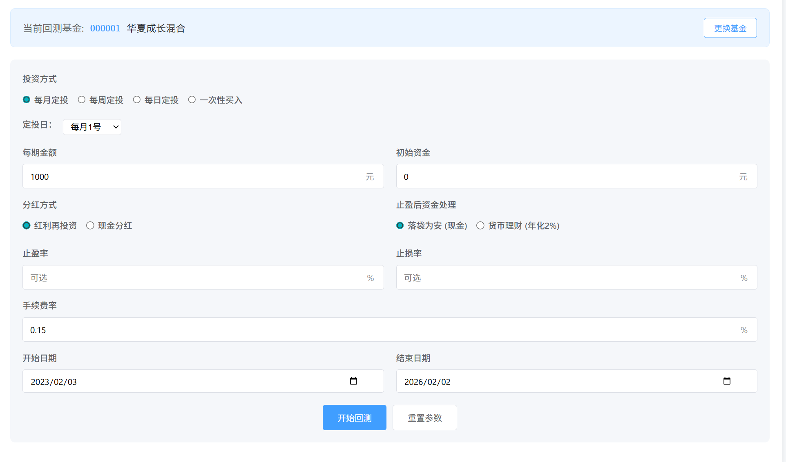
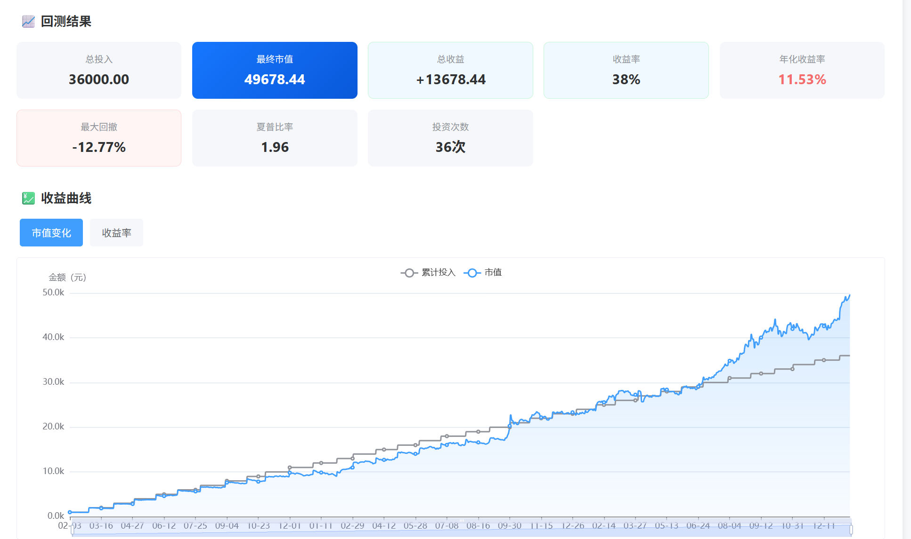

# GoFundBot

[](https://opensource.org/licenses/MIT) []() []()

GoFundBot 是一个基于 Python (Flask) 和 Vue 3 构建的智能基金分析与可视化工具。它不仅提供实时的基金数据查询和可视化图表，还集成了先进的 AI 大模型（LLM），为用户提供深度的基金投资分析、风险评估及市场研判报告。

## 🚀 功能特性

### 🤖 AI 智能投顾
*   **深度基金分析**：基于 LLM 生成专业的基金诊断报告，涵盖业绩归因、风险特征、经理风格及后市策略。
*   **智能仪表盘**：通过 AI 对基金的业绩、管理能力、持仓及市场前景进行多维度打分。
*   **市场情绪摘要**：每日自动生成市场行情摘要，捕捉关键市场动态与板块机会。

### 📊 全面数据可视化
*   **基金详情页**：
    *   **基本信息**：实时净值、估算涨幅、费率结构等。
    *   **业绩走势**：多周期业绩趋势图，支持同类对比。
    *   **资产配置**：股票/债券/现金占比分析。
    *   **持仓透视**：前十大重仓股及其占比变化。
    *   **能力雷达**：直观展示基金的盈利能力、抗风险能力等 5 维指标。
*   **市场概览**：
    *   **全球行情**：上证、深证、纳指、恒生等主要指数实时行情。
    *   **贵金属追踪**：黄金、白银等大宗商品的历史走势与实时数据。

### 🛠 便捷工具
*   **基金搜索**：支持代码/名称快速搜索（本地缓存优化）。
*   **自选管理**：一键添加/移除自选基金，随时跟踪关注标的。
*   **一键部署**：提供 Windows 一键启动脚本，开箱即用。

### 📊 使用方法

#### （1）市场大盘页面

- 市场指数实时走势：展示了上证指数、深证成指、沪深300指数的当日走势。
- 全球行情板块：展示A股、港股、美股重要指数的走势。
- 近7日A股成交量：展示近7个交易日A股的成交量情况。
- 实时贵金属价格：展示黄金9999、现货黄金、现货白银的实时价格及走势。
-  7×24 快讯（右侧边栏）：展示实时重要新闻及其影响行业。
- 行业板块排行（右侧边栏）：展示当日强势板块和弱势板块、主力资金流动情况。


#### （2）基金详情页面

- 搜索基金代码或名称，可以显示基金的详细信息，辅助挑选基金。
- 左侧自选栏：可以将持有的基金添加自选，实时查询估值情况。
- 业绩走势：包含本基金的历史走势、与同类基金和沪深300指数的收益对比、最大回撤及修复情况。
- 同类排名走势：包含选定基金在同类基金中的收益排名情况。
- 资产配置、持有人结构、基金规模变动、申购赎回情况：反应基金持仓的变化与热门度。
- 基金经理能力评估：调用东方财富API，绘制经理能力雷达图。
- 同类基金涨幅榜：辅助挑选同类型优质基金。


- 使用LLM辅助分析基金情况（结论仅供参考）


#### （3）基金筛选

> [!NOTE]
>
> 本功能使用需要下载全部基金数据到本地，数据库大小约8G。受限于API接口，下载速度极慢（大概需要6小时），若不使用本功能不建议下载。

- 提供了4433法则、夏普比率、低波动策略等快速筛选策略，点击即可使用。
- 提供了自定义筛选条件的选择，可以根据基金类型、收益率、回撤等选项筛选基金。



#### （4）基金对比

> [!NOTE]
>
> 最多支持5只基金同时对比，对比前需要先添加基金到自选页。

- 多维度对比基金的收益率、规模、回撤、经理能力等指标，辅助挑选基金。
- 对比最好在同类型基金中展开，跨板块对比意义不大。



#### （5）定投回测

- 目前只支持单基回测，后续会加入组合回测。



- 回测结果：



## 🛠 技术栈

### 后端 (Backend)
*   **语言**: Python 3
*   **框架**: Flask
*   **AI/LLM**: LangChain, OpenAI SDK (适配 SiliconFlow/DeepSeek 等模型)
*   **数据存储**: SQLAlchemy (SQLite)
*   **网络请求**: Requests, Curl_cffi (处理复杂反爬)

### 前端 (Frontend)
*   **框架**: Vue 3 (Composition API)
*   **构建工具**: Vite
*   **UI 组件**: 自定义响应式组件 (FundDetail, MarketOverview 等)
*   **可视化**: ECharts
*   **Markdown**: 支持 AI 报告的 Markdown 渲染

## 📋 环境准备

在运行项目之前，请确保您的本地环境已安装以下软件：

*   **Node.js** (推荐 LTS 版本) 和 `npm`
*   **Python 3.8+** 或 **Anaconda/Miniconda**

## ⚡ 快速开始

### 1. 配置环境变量 (重要)
在 `Backend` 目录下创建一个 `.env` 文件（可复制 `.env.example`），并配置您的 LLM API 密钥：

```ini
LLM_API_KEY=your_api_key_here
LLM_API_BASE=https://api.siliconflow.cn/v1
LLM_MODEL=Qwen/Qwen2.5-7B-Instruct
```

### 2. 启动方式

#### 方式一：一键启动 (Windows)
确保已安装 Conda 且存在名为 `fundbot` 的虚拟环境（或修改脚本适配）。
双击运行根目录下的：

```bash
一键启动.bat
```

#### 方式二：手动安装与启动

**创建环境（Conda）**

```bash
conda create -n fundbot python=3.9
conda init  #这步完成以后重启终端
conda activate fundbot
```

**后端服务 (Backend)**

```bash
cd Backend
pip install -r requirements.txt
python app.py
```

**前端界面 (Frontend)**
```bash
cd Frontend
npm install
npm run dev
```

启动成功后，访问终端显示的本地地址（通常为 `http://localhost:5173`）。

## 📂 项目结构

```text
MyBot/
├── Backend/                 # 后端源码
│   ├── ai_service.py        # AI 分析核心服务
│   ├── fund_api.py          # 基金数据接口
│   ├── app.py               # 应用入口
│   └── ...
├── Frontend/                # 前端源码
│   ├── src/
│   │   ├── components/      # Vue 组件
│   │   │   ├── FundAIAnalysis.vue   # AI 分析组件
│   │   │   ├── FundBasicInfo.vue    # 基础信息组件
│   │   │   ├── MarketOverview.vue   # 市场概览
│   │   │   └── ...
│   │   └── ...
└── ...
```
